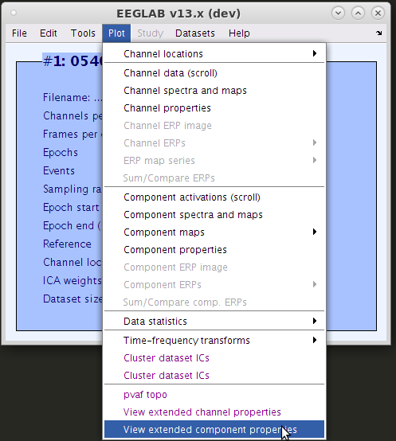
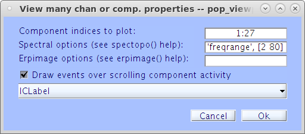
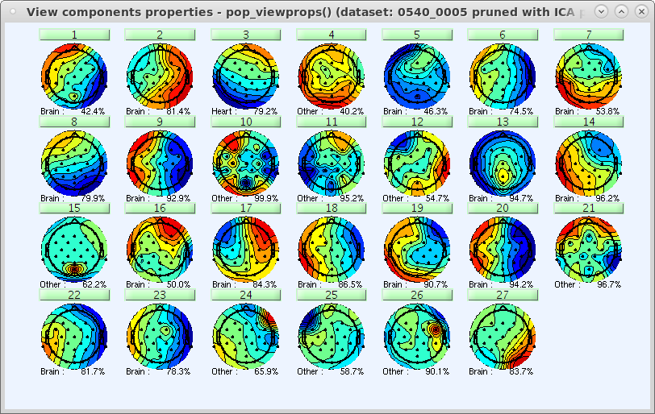

# Viewprops README
Shows the same information as the original EEGLAB pop_prop() function with the addition of a scrolling IC activity viewer, percent channel variance accounted for (PVAF), dipole plot (if available), and component label (if available).


## Usage
### Installation
If you do not have Viewprops installed, install it through the EEGLAB plug-in manager. You can find this in the EEGLAB window under "File"->"Manage EEGLAB extensions"->"Data processing extensions". Once the new window opens, look through the list of plug-ins until you find the "Viewprops" plug-in and mark its checkbox on the left in the column labeled "Install". You will likely have to use the "Next page" button to progress through the list of plug-ins to find Viewprops. Click "Ok" to download the selected plug-ins. You only have to do this once.

### Graphical Usage
Once you finish installing Viewprops, of if you already have it installed, you need to load your EEG dataset. With your dataset loaded, open viewprops using the EEGLAB window by clicking on "Plot"->"View extended [channel/component] properties". A new window, shown to the right, will appear allowing you specify some settings:




**\[Channel/Component\] indices to plot**

Array of numbers indicating which channels or components to plot.

**Spectral options**

Cell array of key/value pairs which will be passed on to spectopo().

**Erpimage options**

Cell array of key/value pairs which will be passed on to erpimage().

**Draw events over scrolling \[channel/component\] activity**

A checkbox indicating whether or not to overlay event times and types on top of the scrolling \[channel/component\] activity.

**IC classifier [component properties only]**

A drop-down menu listing the available IC classifications. The chosen classifier's IC classification will be plotted.

If you're happy with the settings, click the button labeled "Ok" to plot the grid of channels or components specified. Each channel or component is represented in the grid by a scalp topography with a button above it and, in the case of components with classifications available, the most likely IC category. Clicking on the button will open the extended properties viewer show in the picture at the top of this article.



### Command-line Usage
Assuming you have stored your ICA-decomposed EEG dataset in the variable EEG, you can open Viewprops' grid window settings by entering the following into MATLAB's command window:
```
pop_viewprops(EEG, 0) % for component properties
pop_viewprops(EEG, 1) % for channel properties
```
If you know what components and settings you want, you may directly plot the grid by entering the following into MATLAB's command window:
```
pop_viewprops(EEG, 0, component_array, spectopo_options, erpimage_options, scroll_event, classifier_name) % for component properties
pop_viewprops(EEG, 1, component_array, spectopo_options, erpimage_options, scroll_event, classifier_name) % for channel properties
```
where component_array is an array of integers, spectopo_options is a cell array of key/value pairs of options for spectopo(), erpimage_options is a cell array of key/value pairs of options for erpimage(), scroll_event is a zero or one indicating whether (1) or not (0) to plot event indicators on the scroll plot, and classifier name is the name of the classifier from you wish to use to displace component labels (this must match a field in the structure EEG.etc.ic_classification). You need not enter in all these variables, but if you omit any option, you must omit all the following options as well. For example, if you are okay with the default values for everything after spectopo_options, you may simply enter the following into MATLAB's command window:
```
pop_viewprops(EEG, 0, component_array, spectopo_options) % for component properties
pop_viewprops(EEG, 1, component_array, spectopo_options) % for channel properties
```
If you wish to directly access the extended properties settings window, you may do so by entering the following into MATLAB's command window:
```
pop_prop_extended(EEG, 0) % for component properties
pop_prop_extended(EEG, 1) % for channel properties
```
Again, if you know what components and settings you want, you may directly plot the extended properties window(s) by entering the following into MATLAB's command window:
```
pop_prop_extended(EEG, 0, component_array, NaN, spectopo_options, erpimage_options, scroll_event, classifier_name) % for component properties
pop_prop_extended(EEG, 1, component_array, NaN, spectopo_options, erpimage_options, scroll_event, classifier_name) % for channel properties
```
### Additional Capbililities
**Warning: This section is only for advanced users as it may break EEGLAB if other, unforseen changes have already been made to EEGLAB.**

The Viewprops plugin is written to allow for a drop-in replacement of the original pop_prop() function. Therefore, if you wish to generate the extended properties window when using "Tools"->"Reject data using ICA"->"Reject components by map", simply open the code for the function pop_selectcomps() by entering edit pop_selectcomps and editing line 158 (as of the last edit of this article) to change "pop_prop" to "pop_prop_extended".
